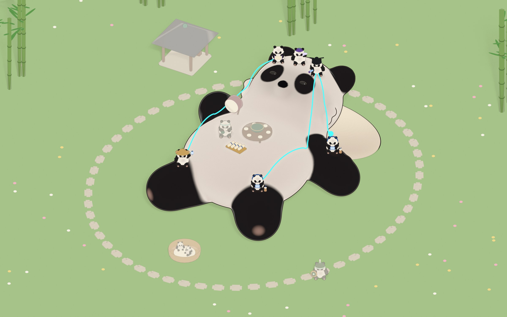

# Dim Sum Den

A local control room for watching and steering a small team of AI agents across the software lifecycle. The team is modeled as a body, and that body is Bao, a large plush panda that the agents perch on.



*A render from `design/3d/renders/`, the design reference for the den, not a capture of the running app.*

## The problem

Give several agents real tickets and you get speed, and you lose the thread. Who is working on what? Which change is waiting on a human? What did the last agent decide, and what did it skip? Dim Sum Den is my answer: agents work through a strict relay on a plain-file board, they stop at gates that only I can open, and a 3D den shows the state at a glance. The agents build it, and I sit at the Pass deciding what goes out.

The name and the metaphor come from dim sum: roles are grouped into stations of a kitchen, such as the Pass (where dishes are checked and sent out) and the Steamers. The rest of this README uses plain terms. The project's own vocabulary is in [`CONTEXT.md`](CONTEXT.md), which is the glossary.

## How it works

- **Agents and roles.** An agent is one running Claude Code session doing one ticket, usually in its own git worktree. Its role is set by a role definition: a markdown file in `.claude/agents/` that fixes its model, tools, skills and done criteria. There are nine roles: `product`, `architect`, `orchestrator`, `developer`, `scout`, `qa`, `security`, `designer` and `herald`.
- **Stations.** Roles are grouped by the outcome they own:
  - the Pass (orchestrator, product, architect) decides and sequences;
  - Steamers (developer, scout) build and dig;
  - Tea & Pantry (qa, security) test and guard;
  - Front of House (designer, herald) keeps things looking right and writes the public posts.
- **The relay.** Code tickets are not a swarm ([ADR 0002](docs/adr/0002-relay-not-swarm.md)). qa writes failing tests, developer makes them pass, qa verifies, security reviews, then the orchestrator proposes the merge.
- **Gates.** Agents stop and ask before pushing, adding a dependency, or editing an ADR or their own role definitions. I approve each ticket once; the orchestrator then runs its whole relay and merges on green CI, stopping only when it needs me (a visual check, a design question, a ticket failing twice).
- **Cheap decisions, logged before trusted.** Two relay choices (which model a developer needs, and how deep QA should verify) are delegated to Jev, a small typed-decision model, through one script (`scripts/jev.mjs`). It never blocks the relay: any error, missing key or daily cap ($0.50) falls back to today's rule. It's running in shadow mode, so every pick is logged next to what the relay actually did. So far, 42 calls across 23 tickets cost $0.0038 in total, at a median of about 460 ms (`kind:"jev"` rows in `.scratch/usage.jsonl`). The picks go live only after a review of those logs ([ADR 0010](docs/adr/0010-jev-precheck-tier-and-verify-depth.md)).
- **The file board.** Tickets are markdown under `.scratch/`, claimed with lock files, handed off through a `board` CLI ([ADR 0003](docs/adr/0003-local-file-board.md), [ADR 0008](docs/adr/0008-board-service.md)). No database, no server, and every state change is diffable.
- **The den UI.** `apps/ui` is a React + React Three Fiber scene of Bao and the agents, with a dashboard panel for the queue, gates and a usage meter. It talks to a localhost bridge (`apps/bridge`, bound to `127.0.0.1`) that reads the board, streams changes over server-sent events at `/events`, and serves `/state` and `/metrics`. Today the UI shows live state, and the one thing it writes is a request to approve or reject a merge or dispatch gate, appended to a log for the orchestrator to act on ([ADR 0011](docs/adr/0011-ui-v0-seams-bridge-snapshot-scene.md)).

## Where this is going

The goal is that all agent interaction happens through the den UI. Right now that is only partly true: the UI shows live state and files gate approve and reject requests, while dispatching agents still runs from the orchestrator session, not from the UI.

## What is built

- The file board and its CLI (`apps/organism-infra`): claim, comment, handoff, release, reclaim, with locks and a release gate that refuses without a handoff.
- The ten role definitions and the shared skills the agents follow (`.claude/`).
- CI helpers (`apps/ci-cd`): a dev server, an HTTP smoke check and a browser smoke check of the UI (Playwright).
- The localhost bridge and the first version of the den UI, including the plush agent models, roaming, a market layout for the stations and handoff animations (`apps/ui/src/scene`).
- Mechanical checks for the rules agents skip most ([ADR 0009](docs/adr/0009-mechanical-checks-for-most-skipped-rules.md)), such as `npm run risk-check` and `npm run check:bom`.

Not built: dispatch from the UI (see above), and runtimes other than Claude Code ([ADR 0004](docs/adr/0004-runtime-adapter.md) sketches the adapter).

## Numbers

Each can be re-run.

- **85 commits on `main`**, 11 of them merges, as of `69a4a57`: `git log --oneline 69a4a57 | wc -l` and `git log --oneline 69a4a57 --merges | wc -l`.
- **78 test files** under `apps/`, `packages/` and `scripts/`: `find apps packages scripts -name "*.test.mjs" -not -path "*/node_modules/*" | wc -l`.
- **52 recorded agent runs across 14 tickets used about 3.04 million tokens and 194 minutes of run time** (an average of about 58k tokens and under 4 minutes per run). Source: the `kind:"cell"` rows of `.scratch/usage.jsonl` on the branch `origin/claude/lucid-gates-42g8ft`, summing `tokens` and `ms`. Some of those rows are marked `backfill:true`, meaning they were reconstructed after the fact rather than logged live.

## Quick start

Needs Node and npm. The UI is a local tool; it is not deployed anywhere.

```
npm ci
npm test              # node:test across apps, packages and scripts
npm run ui            # build the UI, then start the bridge (default port 4317)
npm run ui:dev        # Vite dev server for the UI on its own
npm run smoke         # HTTP smoke check
npm run smoke:ui      # browser smoke check (Playwright + Chromium)
npm run board -- status <feature>/<NN-slug>
```

Agents are run as Claude Code sessions, for example `claude --agent developer`. They use your own Claude subscription through the CLI ([ADR 0001](docs/adr/0001-subscription-cli-cells.md)).

## Local visual review artifact

The restaurant experiments are isolated from the production UI and bridge. In the scene-review checkout:

```sh
npm ci
npm run review:build
open apps/ui/review-dist/DimSumDen-review.html  # macOS; double-click the file elsewhere
```

The generated HTML contains its own JavaScript and styles and loads no remote assets. It offers fourteen characters in three traditional directions (teahouse cooks, scholars, and martial arts travelers), live walking-panda sliders, paw-relative prop fitting, and a larger sample restaurant with a lotus tea pavilion, mahjong table, training courtyard, festival stage, shared dim sum dining table, dragon dance courtyard and bamboo boundary. Use **Play activity** or activate a leisure zone to animate it. These are decorative sample interactions, independent of live agents and tickets.

The review gives the travelers distinct role silhouettes and larger props: a carpenter’s square, mallet, gourd, gaiwan, ribbed lantern, painted fan, herald banner, barrel drum, archive chest and brush palette. The sash follows the belly surface, shoulder caps close the arm seams, and the Cub wears a rounded tiger bonnet. The roaming panda uses four continuous limbs pivoting at shoulder/hip, with no elbow/knee bulges or separate black neck segment. Its black shoulder stripe conforms to the cream body surface. Import earlier review JSON to revisit the original comments on the revised models; pins retain their original world positions.

Dining & dragon revision 4 adds four diners around a rotating lazy Susan with bao, siu mai, har gow, custard buns and tea. The dragon dance has a red-and-gold silk puppet with horns, whiskers and a moving jaw, carried on poles by four pandas following a fifth panda’s pearl. Each new activity can start, pause and stop. Use **View** beside a leisure zone to inspect it closely, or **View whole restaurant** to return to the overview. Bao’s medallion clears the headband, and the Drummer wears a folded festival cap.

Choose **Pin a comment**, click the character, prop or scene, then add a label and comment. Notes and review preferences save on this device where browser storage is available. **Export review JSON** includes the complete comments, camera positions, walking settings and prop adjustments; **Annotated screenshot** captures the current scene with its pins and notes. Send both in chat for feedback. From the generated HTML, **Save annotated artifact** creates another portable HTML file with your review embedded. **Import review** restores an exported JSON packet. This workflow proposes no changes to production.

For development, `npm run review:dev` serves the same review at `http://localhost:5174/`. Run `npm run review:test` for the focused rig, prop, leisure and export checks. The HTML build is required for exporting a self-contained annotated artifact.

## Read more

- [`CONTEXT.md`](CONTEXT.md): the glossary of the project's own terms (organism, station, cell, genome, Bao, perch, and the rest).
- [`docs/adr/`](docs/adr/): the thirteen recorded decisions and why they were made.
- [`docs/agents/`](docs/agents/): how agents use the board, worktrees and process hygiene.
- [`LICENSE`](LICENSE): MIT.
