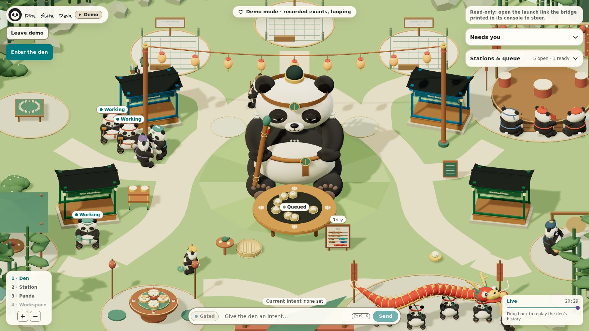

> [!WARNING]
> **Work in progress.** Dim Sum Den is built for one person's workflow (mine), and the agents in it rebuild it every day.
> Expect breaking changes: keys that move, panels that get redrawn, features that come and go without notice.
> If it's close to what you want, fork it and bend it into what you need.

<div align="center">

# 🥟 Dim Sum Den

**A local control room where a small team of AI agents builds software, and you sit at the Pass.**

Agents work tickets through a strict relay on a plain-file board, stop at gates only you can open,
and perch on Bao, a big plush panda, in a 3D den that shows who is doing what at a glance.

[](https://github.com/DerekHertz/DimSumDen/actions/workflows/ci.yml)
[](LICENSE)
[](#requirements)
[](https://r3f.docs.pmnd.rs)
[](https://code.claude.com)

[**Run locally**](#run-locally) · [**Controls**](#controls) · [**How it works**](#how-it-works) · [**Numbers**](#numbers) · [**Development**](#development) · [**Glossary**](CONTEXT.md) · [**Decisions**](docs/adr/)

```sh
npm ci && npm run ui    # then open http://127.0.0.1:4317/?demo=den
```



*The den in Demo mode (`?demo=den`), captured from the running app.*

</div>

---

## What it is

- **A team, not a swarm.** Nine roles (`product`, `architect`, `orchestrator`, `developer`, `scout`, `qa`, `security`, `designer`, `herald`), each a Claude Code session running one ticket in its own git worktree. A role is a markdown file in `.claude/agents/` that fixes its model, tools, skills and done criteria.
- **A kitchen, roughly.** Roles sit at stations named for a dim sum kitchen. The Pass (orchestrator, product, architect) decides and sequences. Steamers (developer, scout) build and dig. Tea & Pantry (qa, security) test and guard. Front of House (designer, herald) keeps things looking right and drafts the public posts.
- **A relay for every code ticket.** qa writes failing tests, a developer makes them pass, qa verifies, a risk check decides whether security reviews, and the orchestrator opens the PR and merges on green CI ([ADR 0002](docs/adr/0002-relay-not-swarm.md)).
- **Gates you can't miss.** Agents stop before pushing, adding a dependency, or editing an ADR or their own role files. You approve a ticket once; the orchestrator runs its whole relay and only comes back for a visual check, a design question, a ticket that failed twice, or a red merge.
- **A board you can diff.** Tickets are markdown under `.scratch/`, claimed with lock files and handed off through a `board` CLI ([ADR 0003](docs/adr/0003-local-file-board.md), [ADR 0008](docs/adr/0008-board-service.md)). No database, no hosted service.
- **The den.** `apps/ui` is a React Three Fiber scene of Bao and the agents, with a dashboard for the queue, gates and usage. Walk up to an agent to read its transcript, message it, or approve or deny what it's waiting on.
- **Demo mode.** Open `?demo=den` or press **Watch the demo** to replay a recorded session into the den. It makes no bridge calls and reads no tokens, and every action that would steer a real agent is greyed out.
- **Cheap decisions, logged before trusted.** Routine relay choices (which model a developer needs, how deep qa verifies) go to Jev, a small typed-decision model, through `scripts/jev.mjs`. It runs in shadow mode: each pick is logged beside what the relay actually did, and any error or missing key falls back to the current rule ([ADR 0010](docs/adr/0010-jev-precheck-tier-and-verify-depth.md)).

## Requirements

- Node.js and npm.
- [Claude Code](https://code.claude.com) on your own subscription, to run the agents ([ADR 0001](docs/adr/0001-subscription-cli-cells.md)).
- `git`, and the GitHub CLI (`gh`) for the orchestrator's PRs and CI checks.
- Optional: Playwright's Chromium, for `npm run smoke:ui`.

Linux, macOS and WSL. It's a local tool, and the bridge binds to `127.0.0.1` only.

## Run locally

```sh
git clone https://github.com/DerekHertz/DimSumDen.git
cd DimSumDen
npm ci
npm run ui              # builds the UI, then starts the bridge on port 4317
```

Open <http://127.0.0.1:4317/>. With no agents running, add `?demo=den` to watch a recorded session.

Run an agent as its own Claude Code session:

```sh
claude --agent orchestrator     # proposes tickets and runs the relay
claude --agent developer        # or any other role in .claude/agents/
npm run next-session            # prints the command to resume from the latest handoff
```

## Controls

| Key | Action |
| --- | --- |
| Walk button | Enter walk mode (the on-screen W A S D pad works on touch screens) |
| W A S D / arrows | Walk; hold Shift to go faster |
| Mouse drag | Look around; double-click to grab the pointer again |
| Tab | Free the cursor to click a card |
| Esc | Close the transcript, or leave walk mode |
| F | Open the transcript of the agent you're standing near |
| T | Message that agent |
| A / D | Approve or deny the request it's waiting on |
| J / K | Next or previous request on a card |
| M | Jump to the note field on a card |
| Ctrl/Cmd + Enter | Send the card's action |
| Ctrl/Cmd + K | Focus the input bar |
| + / − / wheel / pinch | Zoom the overview camera |

## How it works

```
 you ── approve ticket ──▶ orchestrator ──▶ qa specify ──▶ developer ──▶ qa verify ──▶ risk-check ──▶ PR ──▶ merge on green
                                │                                                         │
                                └──── board (.scratch/, locks, handoffs) ◀────────────────┘
                                                      │
                                      bridge (127.0.0.1:4317, /state, /events) ──▶ den UI
```

- **Bridge.** `apps/bridge` reads the board, streams changes over server-sent events at `/events`, and serves `/state` and `/metrics` ([ADR 0011](docs/adr/0011-ui-v0-seams-bridge-snapshot-scene.md)). What you do in the den (approvals, messages) goes back as requests that the orchestrator acts on.
- **Mechanical checks.** The rules agents skip most are enforced by scripts, not by asking nicely: `npm run risk-check`, `npm run check:bom`, `npm run session-check`, and a release gate that won't let an agent drop a ticket without a handoff ([ADR 0009](docs/adr/0009-mechanical-checks-for-most-skipped-rules.md)).
- **Spend you can see.** Every agent run is logged to `.scratch/usage.jsonl` with its model, tokens and time. `npm run spend` totals them per ticket and per role.

Not built yet: launching agents from the den itself, and runtimes other than Claude Code ([ADR 0004](docs/adr/0004-runtime-adapter.md) sketches the adapter).

## Numbers

All of these can be re-run, as of `9d3e57c`.

- **917 commits on `main`**, 128 of them merges: `git log --oneline 9d3e57c | wc -l`, then add `--merges`.
- **231 test files**: `find apps packages scripts -name "*.test.mjs" -not -path "*/node_modules/*" | wc -l`.
- **20 recorded decisions** in [`docs/adr/`](docs/adr/).
- **573 logged agent runs across 122 tickets, about 32.6 million tokens**: the `kind:"cell"` rows of `.scratch/usage.jsonl`, summing `tokens` (17 early rows carry no token count).

## Development

```sh
npm test                # node:test across apps, packages and scripts (runs check:bom first)
npm run ui:dev          # Vite dev server for the UI alone
npm run bridge          # the bridge alone
npm run smoke           # HTTP smoke check
npm run smoke:ui        # browser smoke check (Playwright + Chromium)
npm run risk-check      # decides whether a branch needs a security review
npm run board -- status <feature>/<NN-slug>
```

Layout: `apps/ui` (React + React Three Fiber, built by Vite, the only build step), `apps/bridge` (localhost server), `apps/organism-infra` (the board CLI), `apps/ci-cd` (dev server and smoke checks), `scripts/` (relay tooling). Everything else is Node ESM run with `node --test`.

## More

- [`CONTEXT.md`](CONTEXT.md): the glossary (organism, station, cell, genome, Bao, perch and the rest).
- [`docs/adr/`](docs/adr/): every recorded decision and why it was made.
- [`docs/agents/`](docs/agents/): how agents use the board, worktrees and process hygiene.

## License

[MIT](LICENSE)
